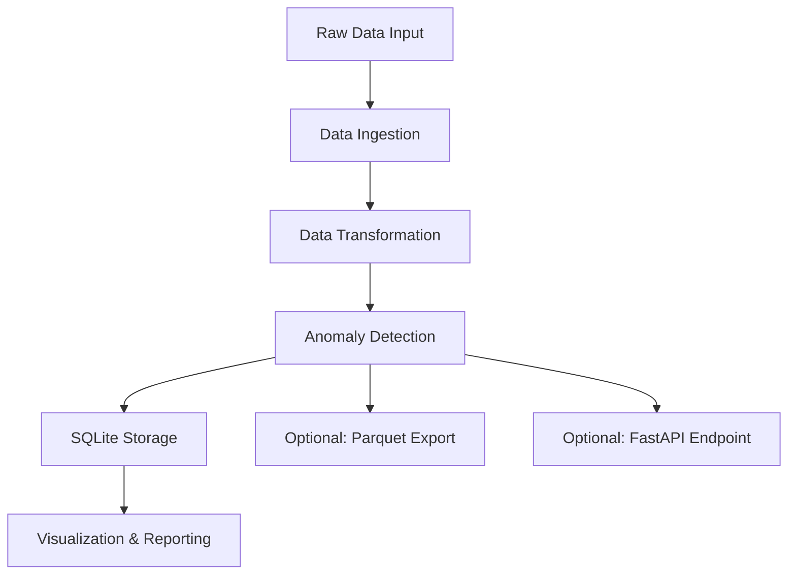

# AutoDataPipeline - Product Requirements Document

## 1. Product Overview
AutoDataPipeline is a professional Python-based data engineering pipeline designed for the automotive sector, simulating real-world vehicle sensor data processing workflows.

The project addresses the need for automated vehicle data processing, anomaly detection, and reporting in automotive applications. It serves data engineers, automotive analysts, and developers who need to process and analyze vehicle sensor data efficiently.

Target completion time: 1-2 hours of coding with production-ready architecture and modular design.

## 2. Core Features

### 2.1 User Roles
| Role | Registration Method | Core Permissions |
|------|---------------------|------------------|
| Data Engineer | Direct system access | Can run full pipeline, configure parameters, access all data |
| API User | API key (optional) | Can access anomaly detection via REST endpoint |

### 2.2 Feature Module
Our AutoDataPipeline consists of the following main components:
1. **Data Ingestion Module**: CSV/JSON file loading, synthetic data generation
2. **Data Transformation Module**: data cleaning, feature engineering, outlier removal
3. **AI Anomaly Detection Module**: scikit-learn based anomaly detection, data labeling
4. **Data Storage Module**: SQLite database operations, optional Parquet export
5. **Visualization & Reporting Module**: time series charts, anomaly highlighting, summary reports
6. **API Module (Optional)**: FastAPI REST endpoint for anomaly detection

### 2.3 Page Details
| Page Name | Module Name | Feature description |
|-----------|-------------|---------------------|
| Main Pipeline | Data Ingestion | Load vehicle sensor data from CSV/JSON files. Generate synthetic dataset with realistic vehicle parameters (speed, engine temperature, GPS coordinates, fuel consumption). |
| Main Pipeline | Data Transformation | Clean missing values using interpolation. Remove outliers using statistical methods. Calculate derived features (average speed, fuel efficiency estimates, distance traveled). |
| Main Pipeline | AI Anomaly Detection | Implement Isolation Forest model for anomaly detection. Apply threshold-based detection for sensor readings. Label anomalous data points for visualization. |
| Main Pipeline | Data Storage | Store processed data in SQLite database with proper schema. Export transformed data to Parquet format for cloud simulation. |
| Main Pipeline | Visualization & Reporting | Generate line charts for speed and engine temperature over time. Highlight anomalies with different colors/markers. Print summary statistics (average speed, anomaly count, data quality metrics). |
| API Endpoint | Anomaly Detection API | Accept sensor data via POST request. Return anomaly predictions and confidence scores. Provide JSON response format. |

## 3. Core Process

**Main Data Pipeline Flow:**
1. System loads raw vehicle sensor data from CSV/JSON files or generates synthetic data
2. Data transformation module cleans and enriches the dataset
3. AI module applies anomaly detection algorithms to identify unusual patterns
4. Processed data with anomaly labels is stored in SQLite database
5. Visualization module generates charts and summary reports
6. Optional: Data is exported to Parquet format and API endpoint is available

**API Flow (Optional):**
1. Client sends POST request with sensor data to /detect-anomaly endpoint
2. API processes data through anomaly detection model
3. API returns JSON response with anomaly predictions

## 4. User Interface Design
### 4.1 Design Style
- Primary colors: Blue (#2E86AB) for data elements, Red (#F24236) for anomalies
- Secondary colors: Gray (#F5F5F5) for backgrounds, Green (#42B883) for success indicators
- Output style: Clean terminal/console output with structured logging
- Chart style: Professional matplotlib styling with clear legends and axis labels
- Font preferences: Monospace fonts for code/logs, sans-serif for charts
- Layout: Modular command-line interface with clear progress indicators

### 4.2 Page Design Overview
| Page Name | Module Name | UI Elements |
|-----------|-------------|-------------|
| Console Output | Pipeline Execution | Structured logging with timestamps, progress bars for data processing, color-coded status messages (INFO: blue, WARNING: yellow, ERROR: red) |
| Data Visualization | Chart Display | Line charts with time-series data, anomaly points highlighted in red, legend showing normal vs anomalous data, grid lines for readability |
| Summary Report | Statistics Display | Tabular format showing key metrics, percentage calculations, data quality indicators |
| API Response | JSON Output | Structured JSON with anomaly predictions, confidence scores, timestamp information |

### 4.3 Responsiveness
The project is designed as a command-line application with optional web API endpoint. No responsive design considerations needed for the core pipeline, but API responses are JSON-formatted for easy integration with web applications.