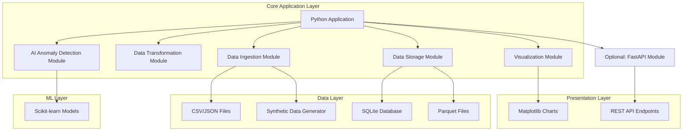
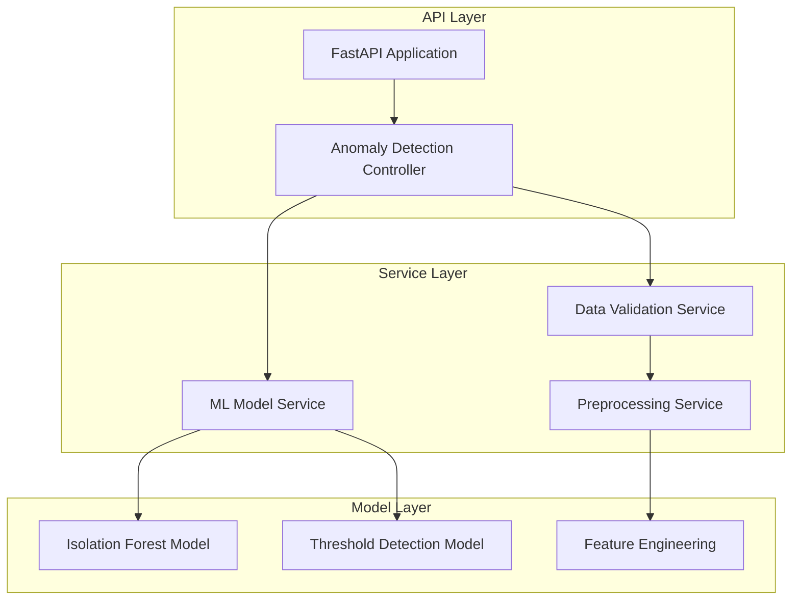
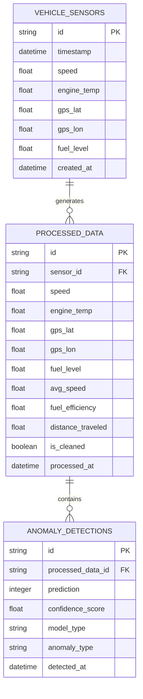

# AutoDataPipeline - Technical Architecture Document

## 1. Architecture Design



## 2. Technology Description

* Frontend: None (Command-line application)

* Backend: Python\@3.8+ with pandas, scikit-learn, matplotlib, sqlite3, fastapi (optional)

* Core Dependencies: pandas\@1.5+, scikit-learn\@1.3+, matplotlib\@3.7+, numpy\@1.24+

* Optional Dependencies: fastapi\@0.104+, uvicorn\@0.24+, pyarrow\@13.0+ (for Parquet support)

* Database: SQLite (built-in)

* Logging: Python logging module

## 3. Route Definitions

| Route    | Purpose                                          |
| -------- | ------------------------------------------------ |
| main.py  | Main pipeline execution entry point              |
| /config  | Configuration management for pipeline parameters |
| /logs    | Log file output directory                        |
| /data    | Input and output data directory                  |
| /reports | Generated visualization and report output        |

## 4. API Definitions

### 4.1 Core API (Optional FastAPI Module)

Anomaly Detection Endpoint

```
POST /api/v1/detect-anomaly
```

Request:

| Param Name   | Param Type | isRequired | Description                                                  |
| ------------ | ---------- | ---------- | ------------------------------------------------------------ |
| sensor\_data | array      | true       | Array of sensor reading objects                              |
| model\_type  | string     | false      | Type of anomaly detection model (default: isolation\_forest) |

Sensor Data Object:

| Param Name   | Param Type | isRequired | Description                   |
| ------------ | ---------- | ---------- | ----------------------------- |
| timestamp    | string     | true       | ISO format timestamp          |
| speed        | float      | true       | Vehicle speed in km/h         |
| engine\_temp | float      | true       | Engine temperature in Celsius |
| gps\_lat     | float      | true       | GPS latitude                  |
| gps\_lon     | float      | true       | GPS longitude                 |
| fuel\_level  | float      | false      | Fuel level percentage         |

Response:

| Param Name         | Param Type | Description                                                 |
| ------------------ | ---------- | ----------------------------------------------------------- |
| predictions        | array      | Array of anomaly predictions (-1 for anomaly, 1 for normal) |
| confidence\_scores | array      | Confidence scores for each prediction                       |
| anomaly\_count     | integer    | Total number of anomalies detected                          |
| processing\_time   | float      | Time taken for processing in seconds                        |

Example Request:

```json
{
  "sensor_data": [
    {
      "timestamp": "2024-01-15T10:30:00Z",
      "speed": 65.5,
      "engine_temp": 85.2,
      "gps_lat": 40.7128,
      "gps_lon": -74.0060,
      "fuel_level": 75.0
    }
  ],
  "model_type": "isolation_forest"
}
```

Example Response:

```json
{
  "predictions": [1],
  "confidence_scores": [0.85],
  "anomaly_count": 0,
  "processing_time": 0.023
}
```

## 5. Server Architecture Diagram



## 6. Data Model

### 6.1 Data Model Definition



### 6.2 Data Definition Language

Vehicle Sensors Table (vehicle\_sensors)

```sql
-- Create table for raw sensor data
CREATE TABLE vehicle_sensors (
    id TEXT PRIMARY KEY,
    timestamp DATETIME NOT NULL,
    speed REAL NOT NULL,
    engine_temp REAL NOT NULL,
    gps_lat REAL NOT NULL,
    gps_lon REAL NOT NULL,
    fuel_level REAL,
    created_at DATETIME DEFAULT CURRENT_TIMESTAMP
);

-- Create index for timestamp queries
CREATE INDEX idx_vehicle_sensors_timestamp ON vehicle_sensors(timestamp);
CREATE INDEX idx_vehicle_sensors_created_at ON vehicle_sensors(created_at DESC);
```

Processed Data Table (processed\_data)

```sql
-- Create table for processed and enriched data
CREATE TABLE processed_data (
    id TEXT PRIMARY KEY,
    sensor_id TEXT,
    speed REAL NOT NULL,
    engine_temp REAL NOT NULL,
    gps_lat REAL NOT NULL,
    gps_lon REAL NOT NULL,
    fuel_level REAL,
    avg_speed REAL,
    fuel_efficiency REAL,
    distance_traveled REAL,
    is_cleaned BOOLEAN DEFAULT FALSE,
    processed_at DATETIME DEFAULT CURRENT_TIMESTAMP,
    FOREIGN KEY (sensor_id) REFERENCES vehicle_sensors(id)
);

-- Create indexes for performance
CREATE INDEX idx_processed_data_sensor_id ON processed_data(sensor_id);
CREATE INDEX idx_processed_data_processed_at ON processed_data(processed_at DESC);
```

Anomaly Detections Table (anomaly\_detections)

```sql
-- Create table for anomaly detection results
CREATE TABLE anomaly_detections (
    id TEXT PRIMARY KEY,
    processed_data_id TEXT NOT NULL,
    prediction INTEGER NOT NULL CHECK (prediction IN (-1, 1)),
    confidence_score REAL NOT NULL,
    model_type TEXT NOT NULL,
    anomaly_type TEXT,
    detected_at DATETIME DEFAULT CURRENT_TIMESTAMP,
    FOREIGN KEY (processed_data_id) REFERENCES processed_data(id)
);

-- Create indexes for anomaly queries
CREATE INDEX idx_anomaly_detections_processed_data_id ON anomaly_detections(processed_data_id);
CREATE INDEX idx_anomaly_detections_prediction ON anomaly_detections(prediction);
CREATE INDEX idx_anomaly_detections_detected_at ON anomaly_detections(detected_at DESC);

-- Insert sample configuration data
INSERT INTO processed_data (id, sensor_id, speed, engine_temp, gps_lat, gps_lon, fuel_level, avg_speed, fuel_efficiency, distance_traveled, is_cleaned)
VALUES 
('sample_001', 'sensor_001', 65.5, 85.2, 40.7128, -74.0060, 75.0, 62.3, 12.5, 150.2, TRUE),
('sample_002', 'sensor_002', 120.0, 95.8, 40.7589, -73.9851, 68.5, 85.7, 10.2, 280.7, TRUE);
```

