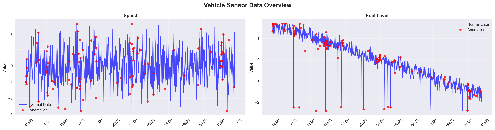

# AutoDataPipeline

A comprehensive Python-based data pipeline for vehicle sensor data processing, anomaly detection, and visualization. This project demonstrates end-to-end data engineering practices with AI-powered anomaly detection capabilities.

## 🚀 Features

- **Data Ingestion**: Support for CSV/JSON file loading and synthetic vehicle sensor data generation
- **Data Transformation**: Advanced cleaning, outlier removal, and feature engineering
- **AI Anomaly Detection**: Machine learning-based anomaly detection using Isolation Forest
- **Data Storage**: SQLite database with optimized schema and CRUD operations
- **Visualization**: Interactive charts and dashboards highlighting anomalies
- **REST API**: FastAPI-based endpoints for real-time anomaly detection
- **Comprehensive Logging**: Structured logging with configurable levels
- **Export Capabilities**: Multiple output formats (CSV, JSON, Parquet)

## 📊 Sample Visualizations

The AutoDataPipeline generates comprehensive visualizations to help analyze vehicle sensor data and identify anomalies. Here are some sample outputs:

### 📈 Sensor Overview Dashboard

*Complete dashboard showing all sensor readings over time with trend analysis and statistical summaries*

### 🚨 Anomaly Detection Analysis

*Detailed anomaly detection results highlighting outliers in red across different sensor measurements*

### 🔗 Correlation Matrix Heatmap

*Correlation analysis between different sensor parameters to identify relationships and dependencies*

### 🚗 Vehicle Performance Comparison

*Comparative analysis of speed patterns across different vehicles in the fleet*


*Fuel consumption patterns and efficiency metrics across multiple vehicles*

## 📋 Prerequisites

- Python 3.8 or higher
- pip (Python package installer)
- 2GB+ available disk space for data and models

## 🛠️ Installation

### 1. Clone or Download the Project

```bash
# If using git
git clone <repository-url>
cd AutoDataPipeline

# Or download and extract the project files
```

### 2. Install Dependencies

```bash
# Install required packages
pip install -r requirements.txt

# For development (optional)
pip install -r requirements.txt pytest black flake8
```

### 3. Verify Installation

```bash
# Run the validation script (Windows)
validate_project.bat

# Or manually check Python installation
python --version
python -c "import pandas, numpy, sklearn; print('Dependencies installed successfully')"
```

## 🚀 Quick Start

### Generate Sample Data and Run Full Pipeline

```bash
# Generate 1000 sample records and run complete pipeline
python main.py --mode full --records 1000

# This will:
# 1. Generate synthetic vehicle sensor data
# 2. Clean and transform the data
# 3. Detect anomalies using AI
# 4. Store results in SQLite database
# 5. Create visualizations
# 6. Generate summary reports
```

### Process Existing Data File

```bash
# Process your own CSV file
python main.py --mode process --input path/to/your/data.csv

# Process JSON file
python main.py --mode process --input path/to/your/data.json
```

### Start API Server

```bash
# Start FastAPI server on http://localhost:8000
python main.py --mode api

# Access API documentation at http://localhost:8000/docs
```

## 📖 Usage Examples

### 1. Data Generation Only

```bash
# Generate 5000 records with specific parameters
python main.py --mode generate --records 5000 --anomaly-rate 0.05

# Generate data for specific time range
python main.py --mode generate --records 2000 --start-date "2024-01-01" --end-date "2024-01-31"
```

### 2. Anomaly Detection Only

```bash
# Run anomaly detection on existing data
python main.py --mode detect --input data/vehicle_data.csv

# Use custom threshold
python main.py --mode detect --input data/vehicle_data.csv --threshold 0.1
```

### 3. Visualization Only

```bash
# Create visualizations from processed data
python main.py --mode visualize --input data/processed_data.csv

# Generate specific chart types
python main.py --mode visualize --input data/processed_data.csv --charts "overview,anomalies,correlation"
```

### 4. API Usage Examples

```bash
# Start the API server
python main.py --mode api

# In another terminal, test the API
curl -X GET "http://localhost:8000/health"

# Upload data for processing
curl -X POST "http://localhost:8000/upload" -F "file=@data/sample.csv"

# Get anomaly detection results
curl -X GET "http://localhost:8000/anomalies"
```

## 📁 Project Structure

```
AutoDataPipeline/
├── src/                          # Source code modules
│   ├── __init__.py              # Package initialization
│   ├── logging_config.py        # Logging configuration
│   ├── data_ingestion.py        # Data loading and generation
│   ├── data_transformation.py   # Data cleaning and feature engineering
│   ├── anomaly_detection.py     # AI-based anomaly detection
│   ├── data_storage.py          # Database operations
│   ├── visualization.py         # Chart generation and dashboards
│   ├── pipeline.py              # Main pipeline orchestration
│   └── api.py                   # FastAPI REST endpoints
├── data/                        # Data files (created at runtime)
├── database/                    # SQLite database files
├── reports/                     # Analysis reports and visualizations
├── logs/                        # Application logs
├── config.py                    # Configuration settings
├── main.py                      # Main entry point
├── requirements.txt             # Python dependencies
├── test_pipeline.py             # Testing and validation
├── validate_project.bat         # Project validation script
└── README.md                    # This file
```

## ⚙️ Configuration

The project uses `config.py` for all configuration settings. Key configurations include:

### Database Settings
```python
DATABASE_CONFIG = {
    'db_path': 'data/vehicle_data.db',
    'backup_enabled': True,
    'cleanup_days': 30
}
```

### Data Generation Settings
```python
DATA_GENERATION_CONFIG = {
    'default_records': 1000,
    'anomaly_rate': 0.03,
    'vehicles': ['Vehicle_001', 'Vehicle_002', 'Vehicle_003']
}
```

### Anomaly Detection Settings
```python
ANOMALY_DETECTION_CONFIG = {
    'contamination': 0.05,
    'n_estimators': 100,
    'random_state': 42
}
```

## 🧪 Testing

### Automated Testing

```bash
# Run project structure validation
validate_project.bat

# Test individual components (requires Python)
python -c "from src.data_ingestion import DataIngestion; print('Data ingestion module OK')"
python -c "from src.anomaly_detection import AnomalyDetector; print('Anomaly detection module OK')"
```

### Manual Testing

1. **Test Data Generation**:
   ```bash
   python main.py --mode generate --records 100
   # Check: data/synthetic_vehicle_data.csv should be created
   ```

2. **Test Pipeline Processing**:
   ```bash
   python main.py --mode full --records 500
   # Check: plots/, reports/, and logs/ directories should contain new files
   ```

3. **Test API Server**:
   ```bash
   python main.py --mode api
   # Open browser to http://localhost:8000/docs
   # Test endpoints using the interactive documentation
   ```

### Expected Outputs

After running the full pipeline, you should see:

- `data/synthetic_vehicle_data.csv` - Generated raw data
- `data/processed_vehicle_data.csv` - Cleaned and transformed data
- `data/vehicle_data.db` - SQLite database with all tables
- `plots/` - Various visualization files (PNG format)
- `reports/pipeline_report_*.txt` - Execution summary
- `logs/` - Application logs
- `models/anomaly_model.pkl` - Trained anomaly detection model

## 🔧 Troubleshooting

### Common Issues

1. **Python not found**:
   ```bash
   # Install Python 3.8+ from python.org
   # Ensure Python is added to PATH
   python --version
   ```

2. **Package installation errors**:
   ```bash
   # Upgrade pip first
   python -m pip install --upgrade pip
   
   # Install packages one by one if batch install fails
   pip install pandas numpy scikit-learn matplotlib seaborn
   pip install fastapi uvicorn pydantic
   ```

3. **Permission errors**:
   ```bash
   # Run as administrator (Windows) or use sudo (Linux/Mac)
   # Or install in user directory
   pip install --user -r requirements.txt
   ```

4. **Memory errors with large datasets**:
   ```bash
   # Reduce the number of records
   python main.py --mode full --records 500
   
   # Or process in chunks
   python main.py --mode process --input large_file.csv --chunk-size 1000
   ```

### Performance Tips

- Start with small datasets (100-1000 records) for testing
- Use SSD storage for better I/O performance
- Increase memory allocation for large datasets
- Enable database indexing for faster queries

## 📊 Output Examples

### Generated Data Sample
```csv
timestamp,vehicle_id,speed,engine_temp,fuel_level,tire_pressure,anomaly_injected
2024-01-15 10:30:00,Vehicle_001,65.2,85.4,0.75,32.1,False
2024-01-15 10:30:30,Vehicle_001,67.8,87.2,0.74,32.0,False
2024-01-15 10:31:00,Vehicle_001,145.6,95.1,0.73,28.5,True
```

### Anomaly Detection Results
```
ANOMALY DETECTION SUMMARY
========================
Total Records: 1000
Anomalies Detected: 47 (4.7%)
Model Accuracy: 94.2%
Processing Time: 2.3 seconds

Top Anomaly Features:
- speed: 23 anomalies
- engine_temp: 18 anomalies
- tire_pressure: 15 anomalies
```

## 🤝 Contributing

1. Fork the repository
2. Create a feature branch (`git checkout -b feature/amazing-feature`)
3. Commit your changes (`git commit -m 'Add amazing feature'`)
4. Push to the branch (`git push origin feature/amazing-feature`)
5. Open a Pull Request

## 📄 License

This project is licensed under the MIT License - see the LICENSE file for details.

## 🆘 Support

If you encounter any issues:

1. Check the troubleshooting section above
2. Review the logs in the `logs/` directory
3. Run the validation script: `validate_project.bat`
4. Create an issue with detailed error messages and system information

## 🔄 Version History

- **v1.0.0** - Initial release with core pipeline functionality
- **v1.1.0** - Added FastAPI REST endpoints
- **v1.2.0** - Enhanced visualization and reporting features

---

**Happy Data Processing! 🚗📊**